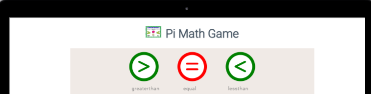
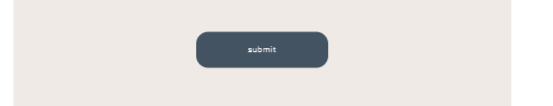
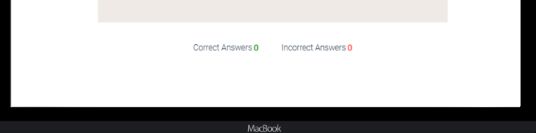
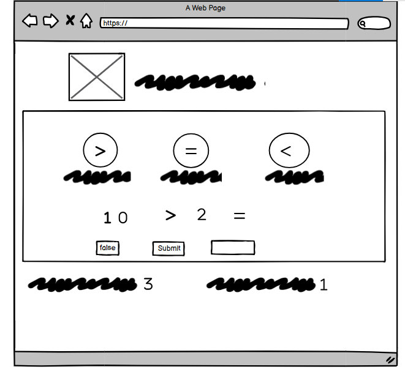
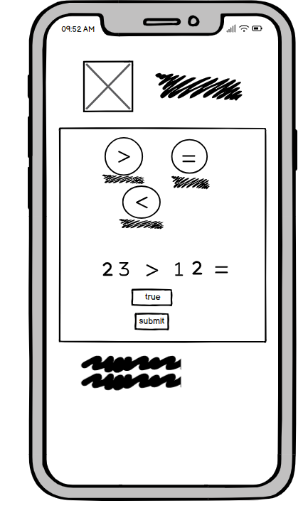

Access the link [here](#https://tes3103.github.io/Pi-Maths-Game/)

## Table Of Contents
* [About The Website](#about-the-website)
  * [Goal](#goal)
  * [Technologies Used](#technologies-used)
* [UX](#ux)
  * [Target Audience](#target-audience)
  * [User Stories](#user-stories)
* [Features](#features)
  * [Existing Features](#existing-features)
    * [Controle Button](#controle-button)
    * [Question Area](#question-area)
    * [Submit](#submit)
    * [Score Area](#score-area)
  * [Future Features](#future-features)
* [Design](#design)
  * [Wireframe](#wireframe)
  * [Topography](#topography)
* [Testing](#testing)
  * [Bugs](#bugs)
  * [Known Issues](#known-issues)
* [Deployment](#deployment)
* [Local Deployment](#local-deployment)
  * [To Fork](#to-fork)
  * [To Clone](#to-clone)
* [Credits](#credits)

* [Acknowledgements](#acknowledgements)  

## About the Website
## Goal
Pi math game website aims to help elementary students (from grade 1 to 4) to advance thir matematical computation. This site mainly works with comparison operations using the three matimatical signs (>, = , <) using easy to play rules with the focus of teaching kids using random numbers.
## Tecnologies Used
* [HTML5](#https://en.wikipedia.org/wiki/HTML5) for the structure of the website
* [CSS3](#https://en.wikipedia.org/wiki/CSS) - for the styling.
* [JS](#https://developer.mozilla.org/en-US/docs/Web/JavaScript) - functions and examples.
* [Blasmiq](#https://balsamiq.com/)  - Used to create wireframes.
* [Gitpod](#https://gitpod.io/workspaces) -  IDE used to create the site.
* [GitHub](#https://github.com/) - To save and store the files for the website.
* [Font Awesome](#https://fontawesome.com/) -  for importing the icones used in the website.
* [Google Fonts](#https://fonts.google.com/) -  for importing tee font style selected for the website.
## UX
## Target Audience
The main target audience for this game would be childrens who are  in elementary school, just start lerning mathematical operation. The random numbers used to compare are easy to guss based on their number knowlwdege and the result score will encourage them to be more accurate by forcing them to be in a competitive mood with their fellow students.
## User Stories
* As a User ,  
  * I would like to paly the game with ease and know what to expect when i press the key
  * I would like to know when i am correct when i play the game
  * I would like to know when i am not correct when i play the game
## Features

## Existing Features
### Control Button
 
 
 This three buttons are used to control the type of game that the user like to paly when they are clicked

 ### Question Area
 

 The quastion area with its answer both will let the user actually play the game after selecing the type of game, the user will put his answer in the answer box provided with true or false

 ### Submit Button
 

 this button is used to submit the user answer, and the user will know wheather the answer was correct or not with the pop up message and and the curser will be in the empty answer box for the next trial 

 ### Score Area
 

 The Score area used to score both correct and incorrect answer by adding on the oldscore to make a competitive environment when palying the game
## Future Features
To make the user more confortable the game will have another option to submit the answer by using only the enter key and adding manual instructions to guide the user how to play the game and all the rules need to be followed.
## Wireframes
* Desktop 

* ipad 

* Mobile 

## Topography
Goggle Font link, was used to import the choosen, Roboto font light 300 wt., it is used  heading, paragraph and input text since it is one of the most distinct to read on screen.

## Testing
### Bugs
| Bug | Status |
| ---| ---|
| small screen size | by adding div |
|    1| 2 |
| 3 | 4|

### Known Issues
*
* 
* 
## Deployment 
* The stapes to follow are the following
1. Login or signup to GitHub
2. Locate the relevant repository
3. Go to settings, 
4. Scroll down to the Pages option on the left-hand side and click into it.
5. Select main in the Source drop down box below the 'Build and deployment' title and click save.

## Local Deployment
* To Fork 
1. Login/signup to GitHub.
2. Locate the relevant repository 
3. Click on the 'Fork' button in the upper left.
* To Clone
1. 
2. 
3.  
## Credits
For the heading and paragraph, Roboto light 300 was used, which i think a good contrast and ease since it is one of the legible to read on screen.
## Acknowledgmets
1. My mentor Mr. Rohit Sharma thank you for all the guidance and support
2. For all slack contributers 